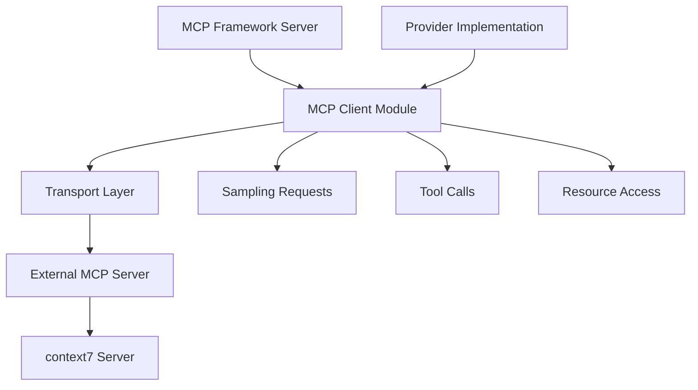
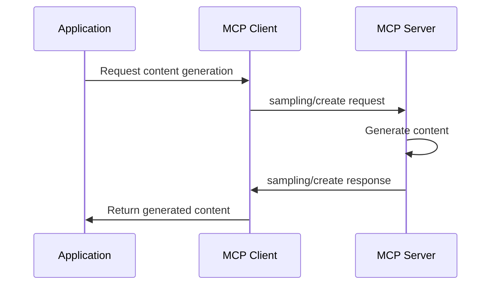

# MCP Framework Standards Compliance Implementation Guide

## Overview

This guide outlines the implementation of full MCP (Model Context Protocol) standards compliance for the MCP Framework. Based on analysis using context7 documentation, the framework currently implements basic server functionality but lacks several key MCP standard features.

## Current Framework Status

✅ **Implemented:**
- Server-side MCP protocol (initialize, tools, resources, prompts)
- Transport layers (STDIO, HTTP)
- Provider architecture (ToolProvider, ResourceProvider, PromptProvider)
- Storage abstractions
- Security features (validation, sanitization, rate limiting)
- Logging infrastructure

❌ **Missing Features:**
- MCP client functionality
- Standardized error codes
- URI scheme validation
- Resource templates
- Logging capability negotiation
- Sampling support

## Implementation Plan

### 1. Add Logging Capability to MCP Initialization

**Objective:** Include logging in MCP capabilities negotiation during initialization.

**Implementation Steps:**
1. Update `McpInitializeRequest` and `McpInitializeResponse` schemas in `src/jsonrpc.ts`
2. Add logging capability interface
3. Modify server initialization to advertise logging support
4. Update capability negotiation logic

**Code Changes:**
```typescript
// Add to capabilities schema
capabilities: z.object({
  tools: z.object({}).optional(),
  resources: z.object({}).optional(),
  prompts: z.object({}).optional(),
  logging: z.object({}).optional(), // NEW
})
```

### 2. Standardize JSON-RPC Error Codes

**Objective:** Align error codes with MCP specification standards.

**Current Issues:**
- Framework uses `PAYLOAD_TOO_LARGE: -32002` but MCP spec defines `Resource not found: -32002`
- Custom codes like `CONCURRENCY_REJECTED: -32001` not in spec

**Implementation Steps:**
1. Update `JSONRPC_ERROR_CODES` in `src/errors.ts`
2. Map existing custom errors to standard codes
3. Update error mapping logic in `mapErrorToJsonRpc()`

**Error Code Mapping:**
```typescript
export const JSONRPC_ERROR_CODES = {
  // Standard JSON-RPC error codes
  PARSE_ERROR: -32700,
  INVALID_REQUEST: -32600,
  METHOD_NOT_FOUND: -32601,
  INVALID_PARAMS: -32602,
  INTERNAL_ERROR: -32603,

  // MCP-specific standard error codes
  RESOURCE_NOT_FOUND: -32002,  // Replace PAYLOAD_TOO_LARGE
  SERVER_ERROR: -32003,        // Replace SERVICE_UNAVAILABLE
  // Remove CONCURRENCY_REJECTED (use standard codes)
} as const;
```

### 3. Implement URI Scheme Validation

**Objective:** Validate MCP resource URIs against standard schemes (https://, file://, git://).

**Implementation Steps:**
1. Create URI validation utility in `src/security.ts`
2. Add scheme validation to resource registration
3. Update resource provider interfaces to validate URIs
4. Add tests for URI validation

**URI Validation Logic:**
```typescript
const VALID_MCP_SCHEMES = ['https:', 'file:', 'git:'];

export function validateMcpUri(uri: string): boolean {
  try {
    const url = new URL(uri);
    return VALID_MCP_SCHEMES.includes(url.protocol);
  } catch {
    return false;
  }
}
```

### 4. Implement Resource Templates

**Objective:** Support dynamic resource URIs with templates.

**Implementation Steps:**
1. Add `ResourceTemplate` support to types
2. Update resource provider interfaces
3. Implement template resolution logic
4. Add template validation

**Resource Template Example:**
```typescript
interface ResourceTemplate {
  uriTemplate: string;  // e.g., "file://{path}"
  name: string;
  description?: string;
  mimeType?: string;
}
```

### 5. Add MCP Client Functionality

**Objective:** Enable connecting to external MCP servers (like context7) with full client protocol support.

**Architecture Overview:**


**Implementation Steps:**
1. Create new `src/client/` directory
2. Implement client transport abstractions
3. Add sampling support (client-side content generation)
4. Create client session management
5. Add client capability negotiation
6. Implement client-side error handling

**Key Components:**
- `McpClient` class for managing connections
- `SamplingClient` for content generation requests
- `ToolClient` for calling external tools
- `ResourceClient` for accessing external resources

### 6. Add Sampling Support

**Objective:** Implement client-side sampling for content generation requests.

**Implementation Steps:**
1. Add sampling schemas to `src/jsonrpc.ts`
2. Implement sampling request/response handling
3. Add sampling client functionality
4. Update client capabilities to include sampling

**Sampling Flow:**


### 7. Update Documentation

**Objective:** Reflect full MCP standards compliance in documentation.

**Implementation Steps:**
1. Update README.md with new capabilities
2. Add client usage examples
3. Update API documentation
4. Create migration guide for existing implementations
5. Add compliance badges/certification

## Testing Strategy

### Unit Tests
- Error code standardization
- URI validation
- Resource template resolution
- Client connection handling

### Integration Tests
- Full MCP client-server communication
- Sampling request/response cycles
- Capability negotiation
- Error handling scenarios

### Compliance Tests
- Validate against MCP specification
- Test with reference implementations
- Cross-version compatibility

## Implementation Order

1. **Phase 1: Standards Alignment** (Low Risk)
   - Error code standardization
   - URI scheme validation
   - Logging capability

2. **Phase 2: Core Extensions** (Medium Risk)
   - Resource templates
   - Documentation updates

3. **Phase 3: Client Functionality** (High Risk)
   - MCP client implementation
   - Sampling support
   - Integration testing

## Risk Assessment

- **Low Risk:** Standards alignment changes (backward compatible)
- **Medium Risk:** New features that extend existing APIs
- **High Risk:** Client functionality (new complex subsystem)

## Success Criteria

- ✅ All MCP standard error codes implemented
- ✅ URI scheme validation working
- ✅ Client can connect to context7 and other MCP servers
- ✅ Sampling requests functional
- ✅ All existing functionality preserved
- ✅ Comprehensive test coverage
- ✅ Documentation updated

## Dependencies

- No external dependencies required
- All changes within existing framework architecture
- Backward compatibility maintained

## Timeline Estimate

- Phase 1: 1-2 days
- Phase 2: 2-3 days
- Phase 3: 3-5 days
- Testing & Documentation: 2-3 days

Total: 8-13 days for complete implementation